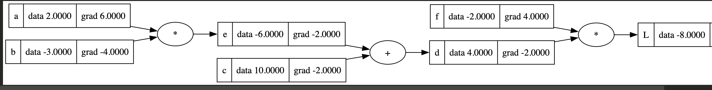

<!-- markdownlint-disable-file MD033 MD045-->
# Micro Grad

## Table of Content

- [Micro Grad](#micro-grad)
  - [Table of Content](#table-of-content)
  - [Derivative](#derivative)
  - [Micro Grad (Initial Implementation)](#micro-grad-initial-implementation)
  - [Calculate Gradients Manually](#calculate-gradients-manually)
    - [1 Using Rate of Change](#1-using-rate-of-change)
    - [2. Using Calculus](#2-using-calculus)
      - [1. dL / dL](#1-dl--dl)
      - [2. dL / dd](#2-dl--dd)
      - [3. dL / df](#3-dl--df)
      - [4. dL / dc](#4-dl--dc)
      - [5. dL / de](#5-dl--de)
      - [6. dL / da](#6-dl--da)
      - [7. dL / db](#7-dl--db)

## Derivative

- The derivative of a function captures the idea of `instantaneous rate of change`.
- In both calculus and machine learning, it tells you how a function's output, denoted by f(x), changes with respect to its input, represented by x.
- Examples:

$$ y=3x^2 -4x + 5 $$

Slope is ...

$$ slope = 6x - 4 $$

If x = 3;
$$ slope = 6(3) - 4 = 14 $$

- Ex 2:

```py
def f(x: int | float) -> int | float:
    """A function that generates a quadratic function."""
    result: int | float = 3 * x**2 - 4 * x + 5
    return result

h: float = 0.001  # A very small number
x: float = 3.0

# Slope
(f(x + h) - f(x)) / h
```

## Micro Grad (Initial Implementation)

```py
class Value:

    def __init__(
        self,
        data: int | float,
        _children: tuple[Any] = (),
        _op: str = "",
        label: str = "",
    ) -> None:
        self.data = data
        self._prev = set(_children)
        self._op = _op
        self.label = label
        self.grad = 0  # No gradient yet

    def __repr__(self) -> str:
        return f"{self.__class__.__name__}(data={self.data})"

    def __add__(self, other: "Value") -> "Value":
        """Addition of two values."""
        return Value(self.data + other.data, (self, other), "+")

    def __mul__(self, other: "Value") -> "Value":
        """Multiplication of two values."""
        return Value(self.data * other.data, (self, other), "*")

a = Value(data=2, label="a")
b = Value(data=6, label="b")

a, b
# (Value(data=2), Value(data=6))

c = a + b
c.label = "c"
d = a * b
d.label = "d"

c._prev, d._prev
# ({Value(data=2), Value(data=6)}, {Value(data=2), Value(data=6)})
```



## Calculate Gradients Manually

### 1 Using Rate of Change

```py
h: float = 0.0001

a = Value(2.0, label="a")
b = Value(-3.0, label="b")
c = Value(10.0, label="c")
e = a * b
e.label = "e"
d = e + c
d.label = "d"
f = Value(-2.0, label="f")
L = d * f
L.label = "L"
L1 = L.data

a = Value(2.0 + h, label="a") # Add the very small value
b = Value(-3.0, label="b")
c = Value(10.0, label="c")
e = a * b
e.label = "e"
d = e + c
d.label = "d"
f = Value(-2.0, label="f")
L = d * f
L.label = "L"
L2 = L.data

deriv: float = (L2 - L1) / h
console.print(f"{deriv=:4f}")

# deriv=6.000000
```

### 2. Using Calculus

- Derive the derivatives:
  - dL / dL
  - dL / dd
  - dL / df
  - dL / dc
  - dL / de
  - dL / da
  - dL / db

#### 1. dL / dL

$$ \frac{dL}{dL} = 1 $$

#### 2. dL / dd

$$ L = d * f $$
$$ \frac{dL}{dd} = \frac{ (f(x + h) - f(x) )}{h} $$
$$ \frac{dL}{dd} = \frac{ ((d+h)*f - (d*f) )}{h} $$
$$ \frac{dL}{dd} = \frac{ (d*f + h*f - d*f )}{h} $$
$$ \frac{dL}{dd} = f $$

#### 3. dL / df

$$ L = d * f $$
$$ \frac{dL}{df} = \frac{ (f(x + h) - f(x) )}{h} $$
$$ \frac{dL}{df} = \frac{ (d*(f+h) - (d*f) )}{h} $$
$$ \frac{dL}{df} = d $$

#### 4. dL / dc

$$ d = c + e $$
Local derivative
$$ \frac{dd}{dc} = 1 $$
Overall derivative
$$ \frac{dL}{dc} = \frac{dL}{dd} * \frac{dd}{dc} $$
$$ \frac{dL}{dc} = f * 1 $$

#### 5. dL / de

$$ d = c + e $$
Local derivative
$$ \frac{dd}{de} = 1 $$
Overall derivative
$$ \frac{dL}{de} = \frac{dL}{dd} * \frac{dd}{de} $$
$$ \frac{dL}{de} = f * 1 $$

#### 6. dL / da

$$ e = a * b $$
Local derivative
$$ \frac{de}{da} = b $$
Overall derivative
$$ \frac{dL}{da} = \frac{dL}{de} * \frac{de}{da} $$
$$ \frac{dL}{da} = f * b $$

#### 7. dL / db

$$ e = a * b $$
Local derivative
$$ \frac{de}{db} = a $$
Overall derivative
$$ \frac{dL}{db} = \frac{dL}{de} * \frac{de}{db} $$
$$ \frac{dL}{db} = f * a $$
