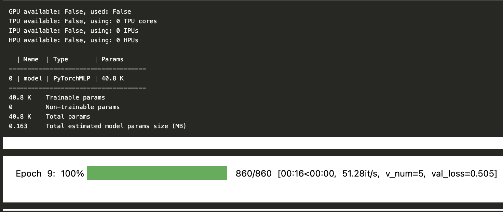

<!-- markdownlint-disable-file MD033 MD045-->
# Pytorch Lightning

- Chek the official [docs](https://lightning.ai/docs/pytorch/stable/).

## Table of Contents

- [Pytorch Lightning](#pytorch-lightning)
  - [Table of Contents](#table-of-contents)
  - [Basic Setup](#basic-setup)
    - [0. PyTorch DataLoader](#0-pytorch-dataloader)
    - [1. Create A Lightning Model](#1-create-a-lightning-model)
    - [2. Training Loop](#2-training-loop)
    - [3. Add Metrics Using TorchMetrics](#3-add-metrics-using-torchmetrics)
    - [4. Add Evaluation Using Test Step](#4-add-evaluation-using-test-step)
    - [5. Organize Code With DataLoaders](#5-organize-code-with-dataloaders)
    - [Load Lightning Model](#load-lightning-model)
    - [Load Lightning Model From Checkpoint](#load-lightning-model-from-checkpoint)

## Basic Setup

### 0. PyTorch DataLoader

```py
import torch
from torch.utils.data import DataLoader
from torch.utils.data.dataset import random_split
from torchvision import datasets, transforms
import lightning as L


def get_dataset_loaders(
    fp: str = "../../data/mnist",
) -> tuple[DataLoader, DataLoader, DataLoader]:
    """This function returns train, validation and test data loaders."""

    seed: int = 42
    batch_size: int = 64

    train_dataset = datasets.MNIST(
        root=fp, train=True, transform=transforms.ToTensor(), download=True
    )

    test_dataset = datasets.MNIST(root=fp, train=False, transform=transforms.ToTensor())

    train_dataset, val_dataset = random_split(
        train_dataset,
        lengths=[55000, 5000],
        generator=torch.Generator().manual_seed(seed),
    )

    train_loader = DataLoader(
        dataset=train_dataset,
        num_workers=0,
        batch_size=batch_size,
        shuffle=True,
    )

    val_loader = DataLoader(
        dataset=val_dataset,
        num_workers=0,
        batch_size=batch_size,
        shuffle=False,
    )

    test_loader = DataLoader(
        dataset=test_dataset,
        num_workers=0,
        batch_size=batch_size,
        shuffle=False,
    )

    return train_loader, val_loader, test_loader
```

### 1. Create A Lightning Model

```py
Model: TypeAlias = nn.Module


class LightningModel(L.LightningModule):
    """
    A PyTorch Lightning module that wraps a PyTorch model, providing training and validation steps, as well
    as configuring the optimizer.

    The `LightningModel` class takes a PyTorch model and a learning rate as input, and provides the
    following functionality:

        - The `forward` method simply passes the input through the PyTorch model.
        - The `training_step` method computes the loss using cross-entropy loss and logs the training loss.
        - The `validation_step` method computes the loss using cross-entropy loss and logs the validation loss.
        - The `configure_optimizers` method sets up an Adam optimizer with the provided learning rate.

    This class can be used as a building block for more complex PyTorch Lightning models, allowing you to easily integrate your PyTorch models into a PyTorch Lightning pipeline.
    """

    def __init__(self, model: Model, learning_rate: float = 0.001) -> None:
        super().__init__()

        self.learning_rate = learning_rate
        self.model = model

    def forward(self, x: torch.Tensor) -> torch.Tensor:
        return self.model(x)

    def training_step(self, batch: int, batch_idx: int) -> torch.Tensor:
        # Fetch the data
        features, true_labels = batch
        # Forward prop
        logits = self(features)
        # Compute loss
        loss = F.cross_entropy(logits, true_labels)
        self.log("train_loss", loss)
        return loss  # this is passed to the optimizer for training

    def validation_step(self, batch: int, batch_idx: int) -> None:
        # Fetch the data
        features, true_labels = batch
        # Forward prop
        logits = self(features)
        # Compute loss
        loss = F.cross_entropy(logits, true_labels)
        self.log("val_loss", loss, prog_bar=True)

    def configure_optimizers(self):
        optimizer = torch.optim.Adam(self.parameters(), lr=self.learning_rate)
        return optimizer
```

### 2. Training Loop

```py
train_loader, val_loader, test_loader = get_dataset_loaders()

pytorch_model: Model = PyTorchMLP(num_features=784, num_classes=10)
lightning_model = LightningModel(model=pytorch_model, learning_rate=0.05)

trainer = L.Trainer(
    max_epochs=10,
    accelerator="auto",  # set to "auto" or "gpu" to use GPUs if available
    devices="auto",  # Uses all available GPUs if applicable
)

trainer.fit(
    model=lightning_model,
    train_dataloaders=train_loader,
    val_dataloaders=val_loader,
)

train_acc: float = compute_accuracy(pytorch_model, train_loader)
val_acc: float = compute_accuracy(pytorch_model, val_loader)
test_acc: float = compute_accuracy(pytorch_model, test_loader)
print(
    f"Train Acc {train_acc*100:.2f}%"
    f" | Val Acc {val_acc*100:.2f}%"
    f" | Test Acc {test_acc*100:.2f}%"
)


PATH: str = "./lightning.pt"
torch.save(pytorch_model.state_dict(), PATH)
```

- Results



### 3. Add Metrics Using TorchMetrics

```py
import torchmetrics


class LightningModel(L.LightningModule):
    """
    A PyTorch Lightning module that wraps a PyTorch model, providing training and validation steps, as well
    as configuring the optimizer.

    The `LightningModel` class takes a PyTorch model and a learning rate as input, and provides the
    following functionality:

        - The `forward` method simply passes the input through the PyTorch model.
        - The `training_step` method computes the loss using cross-entropy loss and logs the training loss.
        - The `validation_step` method computes the loss using cross-entropy loss and logs the validation loss.
        - The `configure_optimizers` method sets up an Adam optimizer with the provided learning rate.

    This class can be used as a building block for more complex PyTorch Lightning models, allowing you to easily integrate your PyTorch models into a PyTorch Lightning pipeline.
    """

    def __init__(self, model: Model, learning_rate: float = 0.001) -> None:
        super().__init__()

        self.learning_rate = learning_rate
        self.model = model

        # === NEW! ===
        # Set up attributes for computing accuracy
        self.train_acc = torchmetrics.Accuracy(task="multiclass", num_classes=10)
        self.val_acc = torchmetrics.Accuracy(task="multiclass", num_classes=10)

    def forward(self, x: torch.Tensor) -> torch.Tensor:
        return self.model(x)

    def training_step(self, batch: int, batch_idx: int) -> torch.Tensor:
        # Fetch the data
        features, true_labels = batch
        # Forward prop
        logits = self(features)
        # Compute loss
        loss = F.cross_entropy(logits, true_labels)
        self.log("train_loss", loss)

        # === NEW! ===
        # Compute training accuracy batch by batch and log
        # it after each epoch. This is much faster!
        predicted_labels = torch.argmax(logits, dim=1)
        self.train_acc(predicted_labels, true_labels)
        self.log("train_acc", self.train_acc, on_step=False, on_epoch=True, prog_bar=True)
        return loss

    def validation_step(self, batch: int, batch_idx: int) -> None:
        # Fetch the data
        features, true_labels = batch
        # Forward prop
        logits = self(features)
        # Compute loss
        loss = F.cross_entropy(logits, true_labels)
        self.log("val_loss", loss, prog_bar=True)

        # === NEW! ===
        # Compute validation accuracy batch by batch and log
        # it after each epoch. This is much faster!
        predicted_labels = torch.argmax(logits, dim=1)
        self.val_acc(predicted_labels, true_labels)
        self.log("val_acc", self.val_acc, prog_bar=True)

    def configure_optimizers(self):
        optimizer = torch.optim.Adam(self.parameters(), lr=self.learning_rate)
        return optimizer
```

- Training Loop

```py
train_loader, val_loader, test_loader = get_dataset_loaders()

pytorch_model: Model = PyTorchMLP(num_features=784, num_classes=10)
lightning_model = LightningModel(model=pytorch_model, learning_rate=0.05)

trainer = L.Trainer(
    max_epochs=10,
    accelerator="auto",  # set to "auto" or "gpu" to use GPUs if available
    devices="auto",  # Uses all available GPUs if applicable
)

trainer.fit(
    model=lightning_model,
    train_dataloaders=train_loader,
    val_dataloaders=val_loader,
)

PATH: str = "./lightning.pt"
torch.save(pytorch_model.state_dict(), PATH)
```

### 4. Add Evaluation Using Test Step

```py
class LightningModel(L.LightningModule):
    """
    A PyTorch Lightning module that wraps a PyTorch model, providing training and validation steps, as well
    as configuring the optimizer.

    The `LightningModel` class takes a PyTorch model and a learning rate as input, and provides the
    following functionality:

        - The `forward` method simply passes the input through the PyTorch model.
        - The `training_step` method computes the loss using cross-entropy loss and logs the training loss.
        - The `validation_step` method computes the loss using cross-entropy loss and logs the validation loss.
        - The `configure_optimizers` method sets up an Adam optimizer with the provided learning rate.

    This class can be used as a building block for more complex PyTorch Lightning models, allowing you to easily integrate your PyTorch models into a PyTorch Lightning pipeline.
    """

    def __init__(self, model: Model, learning_rate: float = 0.001) -> None:
        super().__init__()

        self.learning_rate = learning_rate
        self.model = model

        self.train_acc = torchmetrics.Accuracy(task="multiclass", num_classes=10)
        self.val_acc = torchmetrics.Accuracy(task="multiclass", num_classes=10)

        # === NEW! ===
        # Set up attributes for computing test accuracy
        self.test_acc = torchmetrics.Accuracy(task="multiclass", num_classes=10)
        # Save settings and hyperparameters to the log directory
        # but skip the model parameters
        self.save_hyperparameters(ignore=["model"])

    def forward(self, x: torch.Tensor) -> torch.Tensor:
        return self.model(x)

    def _shared_step(
        self, batch: int
    ) -> tuple[torch.Tensor, torch.Tensor, torch.Tensor]:
        # Fetch the data
        features, true_labels = batch
        # Forward prop
        logits = self(features)
        # Compute loss
        loss = F.cross_entropy(logits, true_labels)
        predicted_labels = torch.argmax(logits, dim=1)
        return loss, true_labels, predicted_labels

    def training_step(self, batch: int, batch_idx: int) -> torch.Tensor:
        # === NEW! ===
        # Use the shared step function
        loss, true_labels, predicted_labels = self._shared_step(batch)

        self.log("train_loss", loss)
        self.train_acc(predicted_labels, true_labels)
        self.log(
            "train_acc", self.train_acc, on_step=False, on_epoch=True, prog_bar=True
        )
        return loss

    def validation_step(self, batch: int, batch_idx: int) -> None:
        # === NEW! ===
        # Use the shared step function
        loss, true_labels, predicted_labels = self._shared_step(batch)

        self.log("val_loss", loss, prog_bar=True)
        self.val_acc(predicted_labels, true_labels)
        self.log("val_acc", self.val_acc, prog_bar=True)

    # === NEW! ===
    def test_step(self, batch: int, batch_idx: int) -> None:
        _, true_labels, predicted_labels = self._shared_step(batch)

        self.test_acc(predicted_labels, true_labels)
        self.log("accuracy", self.test_acc)

    def configure_optimizers(self):
        optimizer = torch.optim.Adam(self.parameters(), lr=self.learning_rate)
        return optimizer
```

- Training Loop

```py
train_loader, val_loader, test_loader = get_dataset_loaders()

pytorch_model: Model = PyTorchMLP(num_features=784, num_classes=10)
lightning_model = LightningModel(model=pytorch_model, learning_rate=0.05)

trainer = L.Trainer(
    max_epochs=10,
    accelerator="auto",  # set to "auto" or "gpu" to use GPUs if available
    devices="auto",  # Uses all available GPUs if applicable
)

trainer.fit(
    model=lightning_model,
    train_dataloaders=train_loader,
    val_dataloaders=val_loader,
)

# === NEW ===
# Evaluate the model using the test step
train_acc = trainer.test(dataloaders=train_loader, verbose=True)[0]["accuracy"]
val_acc = trainer.test(dataloaders=val_loader, verbose=True)[0]["accuracy"]
test_acc = trainer.test(dataloaders=test_loader, verbose=True)[0]["accuracy"]

# === NEW ===
print(
    f"Train Acc {train_acc*100:.2f}%"
    f" | Val Acc {val_acc*100:.2f}%"
    f" | Test Acc {test_acc*100:.2f}%"
)


PATH: str = "./lightning.pt"
torch.save(pytorch_model.state_dict(), PATH)
```

### 5. Organize Code With DataLoaders

```py
class MNISTDataModule(L.LightningDataModule):
    def __init__(
        self, data_dir: str = "../../data/mnist", batch_size: int = 64, seed: int = 42
    ) -> None:
        super().__init__()
        self.data_dir = data_dir
        self.batch_size = batch_size
        self.seed = seed

    def prepare_data(self):
        """Prepare the dataset by downloading the training and test sets from the internet."""
        datasets.MNIST(self.data_dir, train=True, download=True)
        datasets.MNIST(self.data_dir, train=False, download=True)

    def setup(self, stage: str) -> None:
        """Define the setup method which is responsible for loading and splitting the dataset."""
        self.mnist_test = datasets.MNIST(
            self.data_dir, transform=transforms.ToTensor(), train=False
        )
        self.mnist_predict = datasets.MNIST(
            self.data_dir, transform=transforms.ToTensor(), train=False
        )
        mnist_full = datasets.MNIST(
            self.data_dir, transform=transforms.ToTensor(), train=True
        )
        self.mnist_train, self.mnist_val = random_split(
            mnist_full,
            [55_000, 5_000],
            generator=torch.Generator().manual_seed(self.seed),
        )

    def train_dataloader(self):
        return DataLoader(
            self.mnist_train, batch_size=self.batch_size, shuffle=True, drop_last=True
        )

    def val_dataloader(self):
        return DataLoader(self.mnist_val, batch_size=self.batch_size, shuffle=False)

    def test_dataloader(self):
        return DataLoader(self.mnist_test, batch_size=self.batch_size, shuffle=False)

    def predict_dataloader(self):
        return DataLoader(self.mnist_predict, batch_size=self.batch_size, shuffle=False)
```

- Training Loop

```py
torch.manual_seed(42)

# === NEW ===
data_module = MNISTDataModule()

pytorch_model: Model = PyTorchMLP(num_features=784, num_classes=10)
lightning_model = LightningModel(model=pytorch_model, learning_rate=0.05)

trainer = L.Trainer(
    max_epochs=10,
    accelerator="auto",  # set to "auto" or "gpu" to use GPUs if available
    devices="auto",  # Uses all available GPUs if applicable
    deterministic=True,  # === NEW ===
)

# === NEW ===
trainer.fit(model=lightning_model, datamodule=data_module)


train_acc = trainer.test(dataloaders=train_loader, verbose=True)[0]["accuracy"]
val_acc = trainer.test(dataloaders=val_loader, verbose=True)[0]["accuracy"]
test_acc = trainer.test(dataloaders=test_loader, verbose=True)[0]["accuracy"]


print(
    f"Train Acc {train_acc*100:.2f}%"
    f" | Val Acc {val_acc*100:.2f}%"
    f" | Test Acc {test_acc*100:.2f}%"
)


PATH: str = "./lightning.pt"
torch.save(pytorch_model.state_dict(), PATH)
```

---

### Load Lightning Model

```py
#Load Pytorch Model
model = PyTorchMLP(num_features=num_features, num_classes=num_classes)
model.load_state_dict(torch.load(PATH))
model.eval()
```

<br>

### Load Lightning Model From Checkpoint

- [Docs](https://lightning.ai/docs/pytorch/stable/common/checkpointing_basic.html#initialize-with-other-parameters)

```py
MyLightningModule.load_from_checkpoint("/path/to/checkpoint.ckpt", **kwargs)

#.g
pytorch_model = MLPClassifier(num_features=num_features, num_classes=2)
lightning_model = MyLightningModule.load_from_checkpoint(
    checkpoint_path=path,
    model=pytorch_model, # kwargs
)
# disable randomness, dropout, etc...
lightning_model.eval()
# predict with the model
y_hat = lightning_model(x)

```
